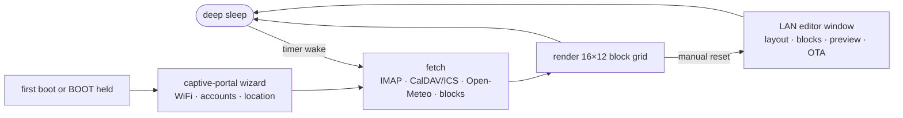

<div align="center">

# e-paper dashboard

**A turn-key email · calendar · weather dashboard for the ESP32 and any GxEPD2 e-paper panel.**


-b32c24)


<!-- Live CI badges — replace OWNER/REPO with your GitHub path after pushing:
[](https://github.com/OWNER/REPO/actions/workflows/ci.yml)
[](https://github.com/OWNER/REPO/actions/workflows/firmware.yml)
-->

| Custom layout with signed community blocks | Drag-and-drop layout editor |
| :---: | :---: |
|  |  |

*Previews rendered by the actual firmware drawing code on a mock framebuffer — no mockups.*

</div>

Flash it once, then configure everything **on the device itself**: a Bootstrap setup
wizard walks through WiFi, email, calendar, weather and clock — live-testing each
step — and the dashboard runs itself from there. No code edits, no cloud backend,
no Google account, no companion app. Credentials never leave the device.

- 📬 **Email** over plain **IMAP** — unread count + newest messages (Migadu, Fastmail, Gmail, iCloud, mailbox.org, any standard server)
- 📅 **Calendar** over **CalDAV** (auto-discovery) or any **ICS link** — today + tomorrow, recurring events expanded
- 🌤 **Weather** from Open-Meteo — no API key, current + 3-day forecast
- 🧩 **Movable blocks** on a 16×12 grid, edited from your browser, plus **signed, declarative community blocks** — data, never code
- 🔄 **OTA updates** from the same web UI, and CI that builds every flashable binary for you



## Supported hardware

Any ESP32 board wired to any [GxEPD2](https://github.com/ZinggJM/GxEPD2)-supported
SPI panel. Presets ship for the common dashboard sizes — pick one line in
`config.h` (or download the matching prebuilt binary):

| Panel | Resolution | Colors | Refresh | Preset | Status |
| --- | --- | --- | --- | --- | --- |
| Waveshare 7.5" (B) V2/V3 | 800×480 | ⬛⬜🟥 | ~25 s | `PANEL_75_B_V2` *(default)* | ✅ tested on hardware |
| Waveshare 7.5" V2 | 800×480 | ⬛⬜ | ~4 s | `PANEL_75_BW_V2` | 🟡 CI-built binary |
| Waveshare 7.5" HD (B) | 880×528 | ⬛⬜🟥 | ~25 s | `PANEL_75_HD_B` | 🟡 CI-built binary |
| Waveshare 5.83" (B) V2 | 648×480 | ⬛⬜🟥 | ~23 s | `PANEL_583_B_V2` | 🟡 CI-built binary |
| 7.5"/5.83" V1 and b/w variants | 640×384 … 648×480 | both | varies | `PANEL_75_B_V1` … | 🟡 CI-built binary |
| **Anything else GxEPD2 drives** | any | both | varies | `PANEL_CUSTOM` | ⚪ escape hatch |

On black&white panels the red accents fold to black automatically; the big clock
steps down its font on narrow panels; the layout grid scales with resolution.

**Boards:** the Waveshare *e-Paper ESP32 Driver Board* works out of the box
(default preset). Any plain ESP32 dev board + adapter (universal Driver HAT,
DESPI-C02, …) uses `BOARD_GENERIC_ESP32` with GxEPD2's standard wiring.
Wiring tables, other chips (S2/S3/C3), and the custom-pin escape hatch:
**[docs/HARDWARE.md](docs/HARDWARE.md)**.

A printable picture-frame enclosure for the 7.5" panel — parametric OpenSCAD
source, four ready STLs and a BOM — lives in
**[hardware/case/](hardware/case/)**.

## Quick start

1. **Get the firmware onto the board** *(the only step at a computer)* — build in
   the Arduino IDE / PlatformIO, or skip toolchains entirely: every push builds
   ready-to-flash binaries per panel in CI. → **[docs/FLASHING.md](docs/FLASHING.md)**
2. **Join the `EPaper-Dashboard` WiFi** the panel announces, and answer the
   wizard's questions — it tests your accounts live and explains any error in
   plain language. → **[docs/SETUP.md](docs/SETUP.md)**
3. **Done.** The dashboard draws within a minute and refreshes on your schedule,
   sleeping between updates.

> [!TIP]
> To change anything later: tap <kbd>RST</kbd> — after the refresh, the device stays
> reachable at `http://epaper-dashboard.local/` for a few minutes with the layout
> editor, block manager, on-panel preview, and OTA updater. Full settings rerun:
> tap <kbd>RST</kbd>, then hold <kbd>BOOT</kbd> ~2 s.

> [!IMPORTANT]
> Updating from v3.0 or earlier (pre-OTA)? One last USB flash migrates the
> partition table — WiFi and settings survive. See
> [docs/FLASHING.md](docs/FLASHING.md#migrating-from-a-pre-ota-install).

## Blocks: community widgets without code

The six classic sections (clock, date, weather, forecast, agenda, inbox) are
built-in blocks on a 16×12 grid — move them, resize them, or add contributed
ones. Contributed blocks are **declarative JSON, never code**: an HTTPS source,
value extractions, and a widget from a fixed vocabulary, interpreted by the
firmware's sandboxed engine (SSRF guards, size caps). They ship as `.epb` files
**signed with ECDSA P-256 and verified on-device**; unsigned installs are
refused unless you explicitly opt in.

Thirteen signed examples live in [`registry/`](registry/) — Hacker News, crypto
price and 24 h change, stocks, FX rates, air quality, UV index, sunrise/sunset,
earthquakes, space launches, public holidays, GitHub stars and a quote of the
day — together with the signing tool and a contribution guide. Spec, trust model
and threat model: **[DESIGN.md](DESIGN.md)**.

> [!WARNING]
> The bundled demo signing key is intentionally public — mint your own with
> `tools/block_sign.py keygen` before trusting a real registry.

## Development

Everything verifies **without hardware**: `bash tests/host/run_tests.sh` strict-compiles
all translation units against the real libraries (plus b/w and alternate-panel
variants), emulates the Arduino IDE's prototype-hoisting quirk, and runs 117 unit
tests including a real mbedTLS signature round-trip. The same suite runs in CI;
a second workflow compiles genuine ESP32 binaries for all seven panel presets and
publishes them as artifacts (and as release assets on `v*` tags).

Contributions welcome — panels, providers, blocks, fixes: **[CONTRIBUTING.md](CONTRIBUTING.md)**.

<details>
<summary><b>Repository layout</b></summary>

```
firmware/epaper_dashboard/
    epaper_dashboard.ino    boot flow, block renderers, deep sleep
    config.h                panel + board selection (the only file you edit)
    portal.cpp/.h           setup wizard + editor server (REST API, OTA)
    portal_assets.h         embedded gzipped Bootstrap UI (generated)
    imap.cpp/.h             minimal IMAP client (TLS, SEARCH, header fetch)
    caldav.cpp/.h           CalDAV discovery + REPORT, ICS streaming
    ics.cpp/.h              iCalendar parser + recurrence expansion
    weather.cpp/.h          Open-Meteo forecast + geocoding
    blocks.cpp/.h           declarative block engine (fetch/extract/draw)
    blocksig.cpp/.h         .epb envelope + ECDSA P-256 verification
    settings.cpp/.h         runtime config in NVS flash
    fsstore.cpp/.h          layout + installed blocks in LittleFS
web/                        wizard/editor source (regen: tools/make_assets.py)
tools/                      asset/font generators, block signing, IDE emulation
tests/                      117-check host suite + self-contained harness
registry/                   signed example blocks + contribution guide
hardware/case/              printable enclosure (OpenSCAD source + STLs)
docs/                       hardware, setup, flashing, troubleshooting
```
</details>

## Documentation

| | |
| --- | --- |
| 🔌 [docs/HARDWARE.md](docs/HARDWARE.md) | panels, boards, wiring, custom pins |
| 🚀 [docs/FLASHING.md](docs/FLASHING.md) | IDE / PlatformIO / no-toolchain flashing, OTA, migration |
| 🧭 [docs/SETUP.md](docs/SETUP.md) | the wizard, providers (Migadu, iCloud, …), buttons, behavior |
| 🩺 [docs/TROUBLESHOOTING.md](docs/TROUBLESHOOTING.md) | blank panel, WiFi, IMAP/CalDAV, OTA |
| 🧩 [DESIGN.md](DESIGN.md) | block system spec + threat model |
| 🖨 [hardware/case/](hardware/case/) | printable enclosure, BOM, print settings |
| 🔏 [SECURITY.md](SECURITY.md) | trust model summary, reporting |

## License

[MIT](LICENSE) — © sasha zero. Fonts: DejaVu (free license); UI: Bootstrap (MIT);
see [THIRD_PARTY.md](THIRD_PARTY.md).
