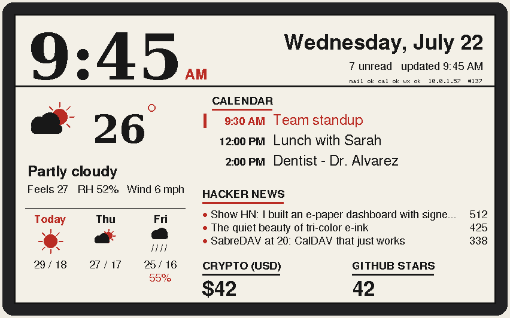
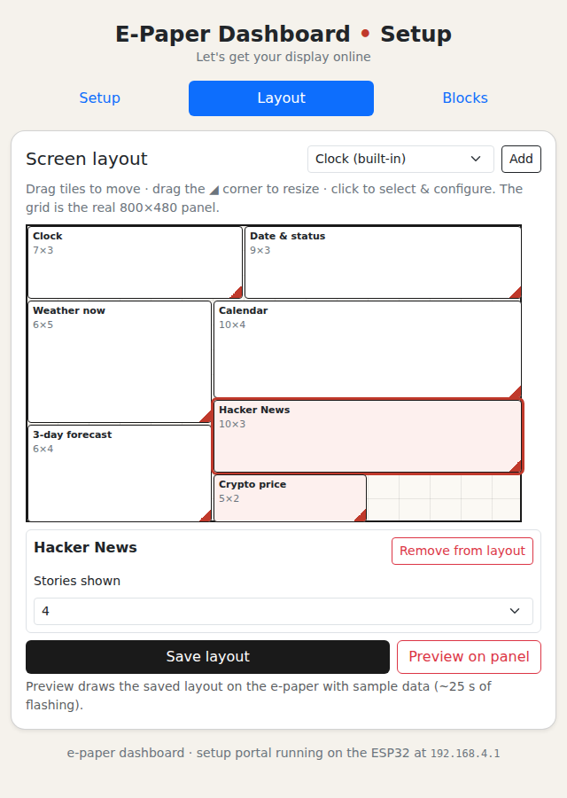

<div align="center">

# e-paper dashboard

**Email, calendar and weather on any ESP32 and any GxEPD2 e-paper panel — configured on the device, no cloud, no app.**

[](https://github.com/armeehn/epaper-dashboard/actions/workflows/ci.yml)
[](https://github.com/armeehn/epaper-dashboard/actions/workflows/firmware.yml)


[](LICENSE)

| Custom layout with signed community blocks | Drag-and-drop layout editor |
| :---: | :---: |
|  |  |

*Rendered by the firmware's own drawing code on a mock framebuffer — not mockups.*

</div>

Flash once, then configure everything **from the device itself**: a setup wizard
walks through WiFi, email, calendar, weather, clock and optional add-on blocks,
testing each step live. Credentials never leave the board.

- **Email** over IMAP — unread and flagged messages, with auto-detection for any
  mail domain and presets for the common providers
- **Calendar** over CalDAV (with `.well-known` discovery) or any ICS link,
  recurring events expanded
- **Weather** from Open-Meteo — no API key
- **Blocks** on a 16×12 grid, arranged from your browser, plus signed community
  blocks that are **data, never code**
- **OTA updates** from the same page, and CI that builds every flashable binary

## Hardware

Any ESP32 board wired to any [GxEPD2](https://github.com/ZinggJM/GxEPD2)-supported
SPI panel: pick one of seven presets in `firmware/epaper_dashboard/config.h`
(7.5" and 5.83", 3-colour and b/w, 640×384 to 880×528), or `PANEL_CUSTOM` for any
other driver class. Grid, fonts and colour handling adapt to the panel, and the
setup page describes the one it is actually running on. Wiring and a printable
enclosure: **[docs/HARDWARE.md](docs/HARDWARE.md)**, **[hardware/case/](hardware/case/)**.

## Quick start

1. **Get the firmware onto the board** — Arduino IDE, PlatformIO, or download a
   prebuilt binary for your panel from CI. → **[docs/FLASHING.md](docs/FLASHING.md)**
2. **Join the `EPaper-Dashboard` network** the panel announces and answer the
   wizard. → **[docs/SETUP.md](docs/SETUP.md)**
3. **Done.** The dashboard draws within a minute and sleeps between refreshes.

> [!TIP]
> To change anything later, tap <kbd>RST</kbd>: after the refresh the device stays
> reachable at `http://epaper-dashboard.local/` for a few minutes with the layout
> editor, store, preview and OTA updater. To rerun full setup, tap <kbd>RST</kbd>
> then hold <kbd>BOOT</kbd> for ~2 s.

## Blocks

The six built-in sections sit on the same grid as contributed blocks, which are
**declarative JSON**: an HTTPS source, value extractions, and a widget from a
fixed vocabulary, run by a sandboxed on-device engine. They ship as `.epb` files
signed with ECDSA P-256 and verified before anything is stored.

Thirteen signed blocks live in
**[armeehn/epaper-blocks](https://github.com/armeehn/epaper-blocks)**, vendored
here as the `registry/` submodule and offered in the wizard's store step.
Contributions go to that repository; spec and threat model are in
**[DESIGN.md](DESIGN.md)**.

## Development

Everything verifies **without hardware**:

```sh
git clone --recurse-submodules https://github.com/armeehn/epaper-dashboard
bash tests/host/run_tests.sh
```

That strict-compiles every translation unit against the real libraries, builds
alternate-panel variants, emulates the Arduino IDE's prototype-hoisting quirk,
and runs 126 unit checks including a real mbedTLS signature round-trip — the
same gate CI runs, alongside a workflow that builds binaries for all seven
presets. Contributions welcome: **[CONTRIBUTING.md](CONTRIBUTING.md)**.

## Documentation

| | |
| --- | --- |
| 🔌 [docs/HARDWARE.md](docs/HARDWARE.md) | panels, boards, wiring, custom pins |
| 🚀 [docs/FLASHING.md](docs/FLASHING.md) | flashing, OTA, migrating a pre-OTA install |
| 🧭 [docs/SETUP.md](docs/SETUP.md) | the wizard, providers, buttons, behaviour |
| 🩺 [docs/TROUBLESHOOTING.md](docs/TROUBLESHOOTING.md) | blank panel, WiFi, IMAP/CalDAV, OTA |
| 🧩 [DESIGN.md](DESIGN.md) | block system spec and threat model |
| 🖨 [hardware/case/](hardware/case/) | printable enclosure, BOM, print settings |
| 🔏 [SECURITY.md](SECURITY.md) | trust model, reporting |

## Licence

[MIT](LICENSE) — © sasha zero. Fonts: DejaVu; UI: Bootstrap (MIT). See
[THIRD_PARTY.md](THIRD_PARTY.md).
