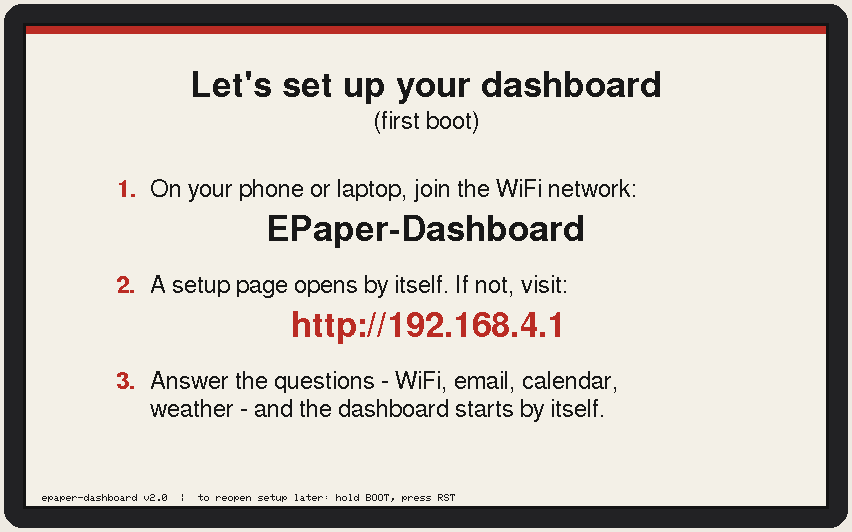
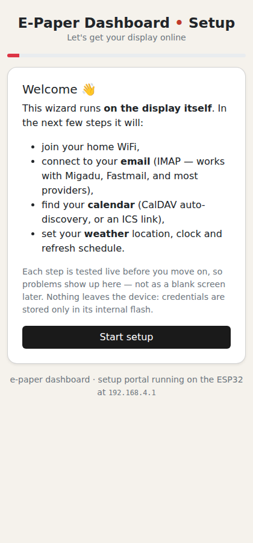
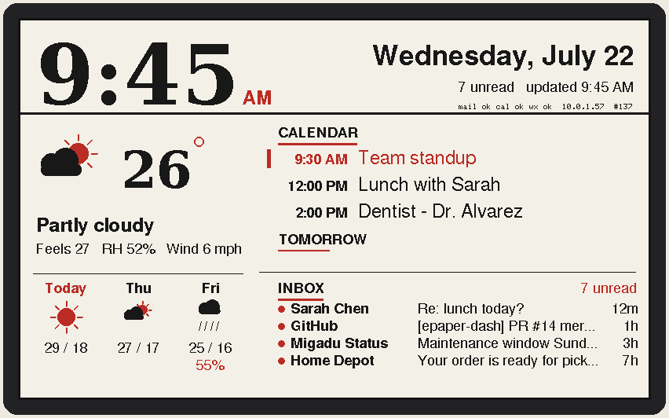
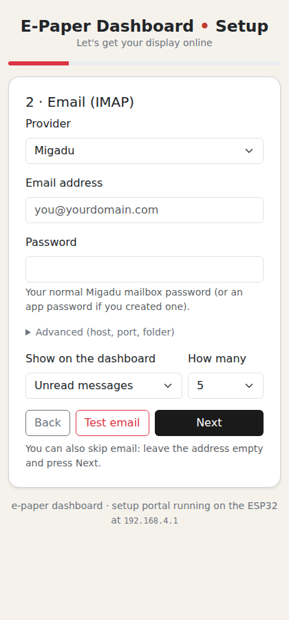
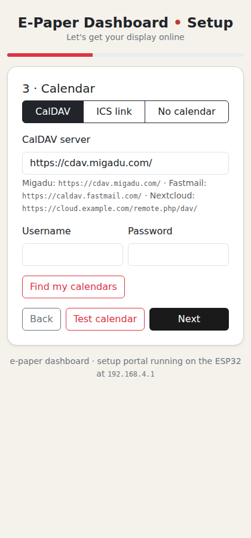

# Setup & everyday use

## The turn-key flow

1. **Flash the firmware** (once — [docs/FLASHING.md](FLASHING.md)).
2. The panel shows a welcome screen: *join the WiFi network
   `EPaper-Dashboard`, then open `http://192.168.4.1`*. On phones the page
   usually pops up by itself (captive portal).
3. **Answer the wizard's questions.** It walks WiFi → email → calendar →
   weather → clock & refresh → store, and **tests every step live on the
   device**: it
   scans and joins your WiFi (staying reachable through its own hotspot), logs
   into IMAP and shows your newest matching message, discovers and lists your
   CalDAV calendars to pick from, geocodes your city, and suggests a timezone.
   Errors appear right there, in plain language.
4. **Save & start** — the device reboots and draws the first dashboard within
   about a minute.

| 1 · what the panel shows first | 2 · the wizard in your browser | 3 · the finished dashboard |
| :---: | :---: | :---: |
|  |  |  |

| Email step — tested live against your server | Calendar step — discovered CalDAV calendars |
| :---: | :---: |
|  |  |

## Buttons

| Gesture | Effect |
| --- | --- |
| tap <kbd>RST</kbd> | refresh now, then keep the **editor window** open on your LAN for a few minutes (layout, blocks, preview, OTA — with your real data) |
| tap <kbd>RST</kbd>, then press & hold <kbd>BOOT</kbd> ~2 s | reopen the full **setup portal** (own hotspot, existing values pre-filled; passwords never echo back) |

> [!CAUTION]
> Order matters. Holding <kbd>BOOT</kbd> *while* <kbd>RST</kbd> is released puts
> the ESP32 into its ROM flashing mode — the chip sits silent until the next
> plain reset. If the board seems dead, just tap <kbd>RST</kbd> alone.

The portal also reopens automatically after 5 consecutive failed WiFi cycles,
so a changed router password can't strand the display.

## Email and calendar providers

The device speaks plain IMAP and plain CalDAV with no vendor APIs, so **any
server implementing them works**. The wizard's dropdowns are conveniences on
top of that, not the supported set.

**Email.** Type your address first: if the domain is a known one the provider
is selected and every server detail filled in — Migadu, Fastmail, Gmail /
Workspace, iCloud, mailbox.org, Posteo, Zoho, Yahoo, AOL, Yandex, GMX, WEB.DE,
Purelymail and StartMail all ship as presets, each with a note saying what the
password actually is (several require an app password).

For anything else — your own Dovecot, shared hosting, a provider nobody has
added — press **Detect**. The device connects to `imap.`, `mail.`, the bare
domain, `imap4.` and `secure.` in turn and reports the first that answers with
an IMAP greeting. No password is sent while detecting; only public DNS names
are tried, so it cannot be aimed at your LAN. Failing that, fill in the host
under *Advanced*.

**Calendar** is chosen independently of email, so you can read one provider's
mail and another's calendar. Presets cover the same providers plus Nextcloud /
ownCloud, Baïkal, Radicale, Synology and Zimbra. For anything else, enter the
server's URL: the device follows `/.well-known/caldav` to your calendar list,
so the plain domain is usually enough, and *Find my calendars* lists what it
found.

> [!NOTE]
> **Some providers cannot work at all**, and the wizard says so rather than
> half-working. Microsoft (Outlook.com, Hotmail, Microsoft 365) has withdrawn
> password logins for IMAP in favour of OAuth2, which a standalone device
> cannot do. Proton exposes IMAP only through Proton Mail Bridge on a
> computer. Tuta has no IMAP at all. For calendars, Google and Microsoft both
> work fine through a published **ICS link**.

## The store

The last wizard step offers optional blocks — extra tiles like air quality,
sunrise and sunset, a stock price or the Hacker News front page — from the signed registry
at [armeehn/epaper-blocks](https://github.com/armeehn/epaper-blocks). Browse by
category, install what you want, and arrange it later in the **Layout** tab.
The step is entirely skippable, and the same catalogue is available any time
from the **Blocks** tab.

Each block's signature is checked against the keys compiled into the firmware
before anything is stored, and a block is data rather than code — see
[DESIGN.md](../DESIGN.md) for what one can and cannot do. Pointing the store at
a different registry is a runtime setting; trusting a different signing key
needs a reflash.

## Everyday behavior

- **Refresh cadence** — aligned to wall-clock boundaries (:00/:05/…), minimum
  3 minutes. Tri-color panels flash for ~20–30 s per refresh; b/w for ~2–5 s.
  The clock shows the time as of the refresh.
- **Quiet hours** — overnight the display pauses (configurable); e-paper holds
  its image with zero power, and refreshes resume in the morning.
- **Offline resilience** — last-good data is cached in RTC memory across deep
  sleep. Network hiccups show a red OFFLINE border and per-section error
  messages instead of a blank panel; repeated crashes degrade gracefully
  (skip heaviest fetches first) rather than freezing the screen.
- **Recurring events** — the CalDAV server is asked to expand recurrences;
  if it can't, the device expands DAILY/WEEKLY rules itself (INTERVAL, BYDAY,
  COUNT, UNTIL, EXDATE, moved occurrences). MONTHLY/YEARLY fall back to the
  master date — a deliberate limitation.
- **Networking** — on your LAN the device is a plain DHCP client (current
  lease shown in the dashboard footer — handy for a DHCP reservation, and
  it registers `epaper-dashboard.local` via mDNS). The setup hotspot lives on
  its own 192.168.4.0/24 subnet so AP+STA routing can't collide mid-wizard
  (`PORTAL_AP_IP*` in `config.h` changes it if your LAN uses that range).

## Security model

The setup hotspot is open by default and only exists during setup — set
`PORTAL_AP_PASS` in `config.h` to protect it. TLS connections skip certificate
validation (no CA store management on a microcontroller) — fine for a home
dashboard, worth knowing. Credentials sit unencrypted in NVS flash, as is
normal for ESP32 projects; physical USB access can read them. The LAN editor
window (including OTA upload) trusts your LAN while it's open — on a shared
network, shorten the window or use the password-protected settings portal
instead. Full block-system threat model: [DESIGN.md](../DESIGN.md).
