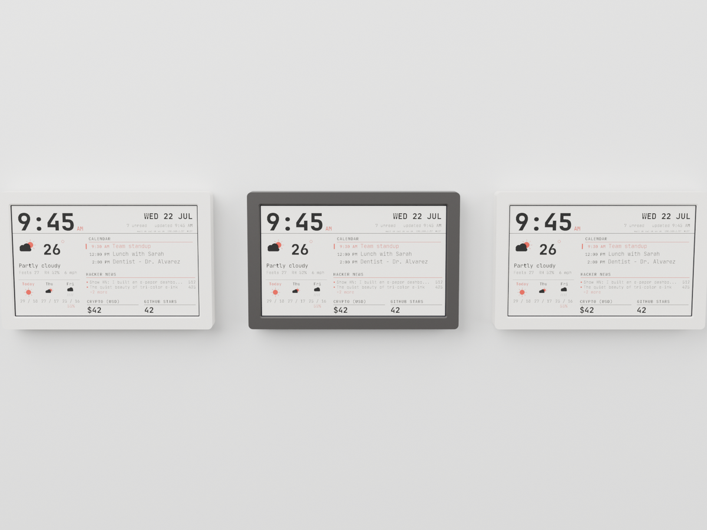
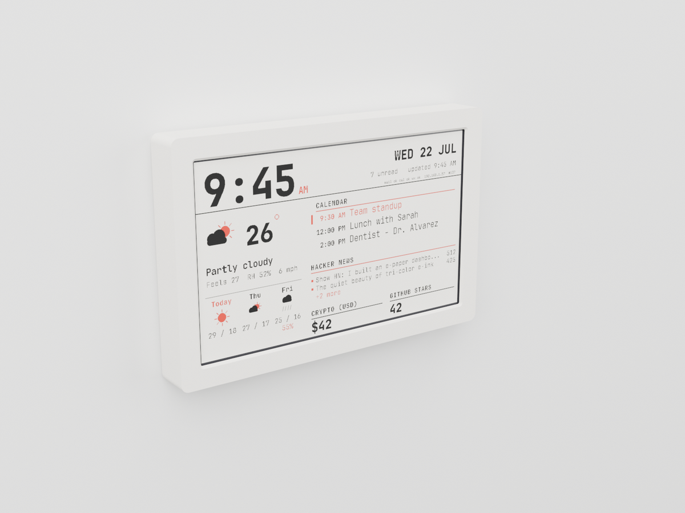
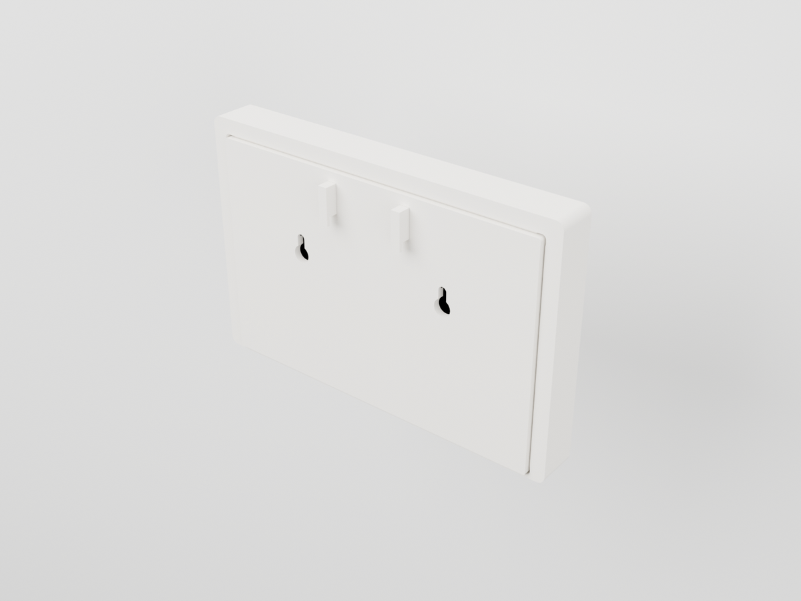
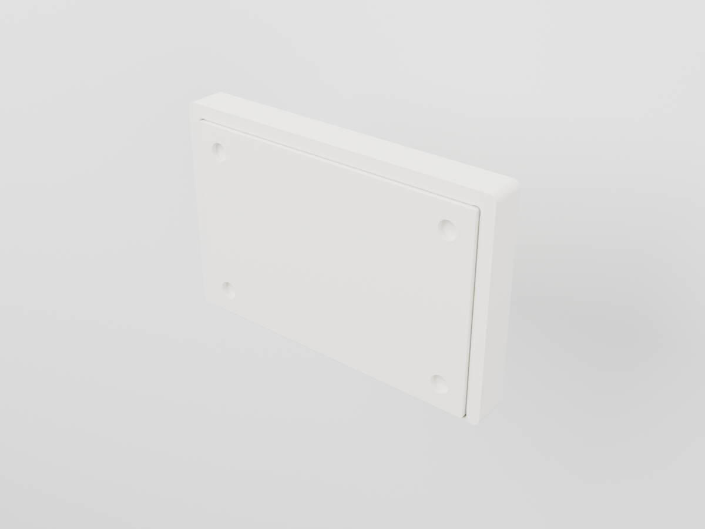
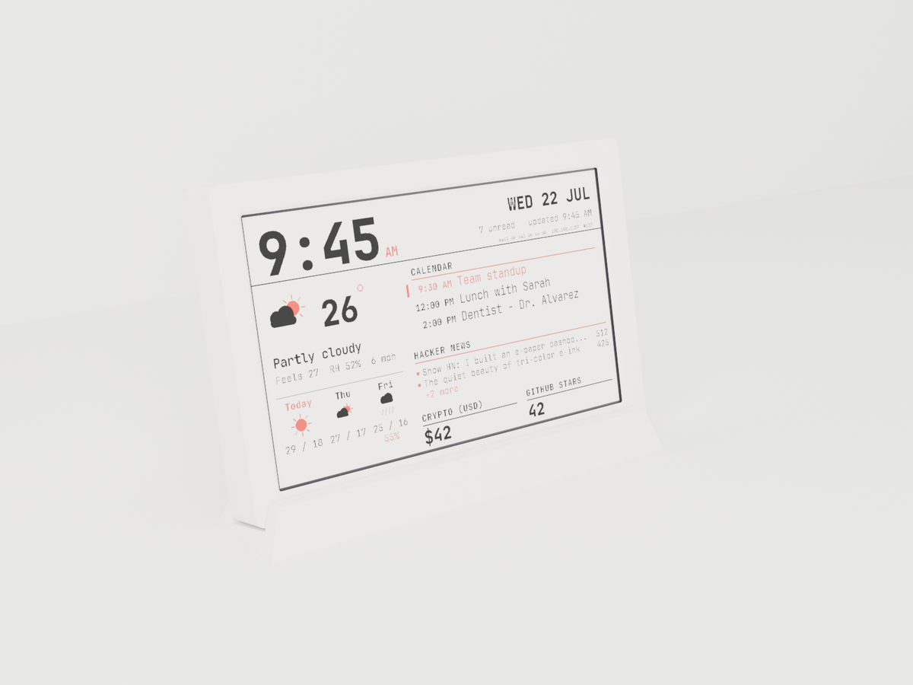

# RUTA series

Cases for the 7.5" panel on the low-cost build ([`docs/LOW_COST.md`](../../docs/LOW_COST.md)):
Good Display GDEY075T7 glass, XIAO ESP32-C3 on Seeed's ePaper Driver Board. Four
products, one series: every one is the same front **frame** plus one printed **back**;
the pegboard unit adds two **hooks**, the desk unit a **plinth**. Swap a back or add a
part and a wall unit becomes a fridge unit or a pegboard unit.
No screws, no glue, no supports. Prints in PLA on a 256 mm bed.

| | Product | Hangs by | Parts | Print time* |
| --- | --- | --- | --- | --- |
|  | **RUTA** wall frame | two keyholes, 80 mm apart | `frame` + `back_wall` | ~5 h |
|  | **KROK** pegboard frame | two SKÅDIS hooks, 40 mm apart | RUTA + 2 × `hook` | ~5 h |
|  | **FAST** magnetic frame | four 10 × 3 mm disc magnets | `frame` + `back_magnet` | ~5 h |
|  | **STÖD** desk frame | its own plinth, 12° lean | RUTA + `stand` | ~6 h |

\* 0.2 mm layers, 15 % infill, one X1C; a frame is about 3 h of it.

## Measurements

- Frame: **188 × 122 × 22 mm**. Border 11 mm all round; window 165 × 100 mm.
- With the XIAO soldered flat instead of on headers (`xiao_headers = false`): 14 mm deep.
- Plinth (STÖD): 188 × 42 × 18 mm. Whole unit on the desk: 188 × 50 × 138 mm.
- Weight, printed: frame ~62 g, a back ~45 g, plinth ~55 g. Glass and board add 45 g.

## Good to know

- The glass goes in from the back, into a pocket that holds nothing else. Two strips of
  1 mm foam tape: one on the front ledge under the glass border, one on the back's rim.
- The driver board drops onto four corner posts, ribbon side down. It needs no clip: the
  stack ends 1 mm short of the foam behind the glass, so it cannot lift.
- The back snaps into the frame's side walls with four 0.7 mm bumps. Open it with a
  fingernail in the bottom corner; the bumps last.
- USB-C leaves through the bottom edge. On STÖD the cable runs under the plinth and out
  the back, so the desk stays clean.
- **FAST** takes four N35 discs, 10 × 3 mm, pressed in from the outside. It holds on a
  fridge door, a whiteboard, a steel cabinet. Not on a car.
- **KROK** is RUTA with two hooks keyed through the slots in its back, flange inside,
  fitted before the back snaps on. They hang on IKEA SKÅDIS or any 5 mm pegboard with
  5 × 15 mm slots on a 40 mm pitch. Lift, tilt, drop. On a wall the two slots stay empty.
- Two of the numbers are marked `** MEASURE **` in `serie.scad`: the driver board's
  outline (`drv_l`, `drv_w`) and where its USB-C sits (`usb_x`). Seeed publishes neither.
  Measure yours, set them, run `./build.sh`.

## Care

Wipe with a dry cloth. PLA softens above 55 °C: not in a car, not over a radiator.

## Print

| Part | Orientation | Notes |
| --- | --- | --- |
| `frame` | face down | the window chamfer prints as a 45° overhang, no support |
| `back_wall`, `back_magnet` | outer face down | posts stand up; the magnet pockets bridge 1.2 mm |
| `hook` (× 2) | on its side, as exported | one flat profile, 4.6 mm thick |
| `stand` | base down | |

Bone or ink: the brand's two colours ([`BRAND.md`](../../BRAND.md)). A matte PLA in either.

## Files

- `serie.scad`: the whole series, one parametric model. `part=` selects a part, a fit
  check, an assembled preview or a render export.
- `build.sh`: runs the fit checks, then regenerates `stl/` and `previews/`.
- `../case/fit_check.sh ../cases/serie.scad`: the four invariants, run in CI. Nothing in the
  glass's path, the back closes, the board seats, the board drops in.
- `render_catalogue.py`: the catalogue shots (Blender Cycles, headless; see its docstring).
- `catalogue/`: those shots. `previews/`: OpenSCAD views.

The earlier, deeper case for the Waveshare driver board is in [`../case/`](../case/).
